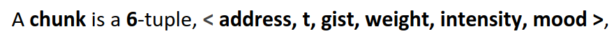
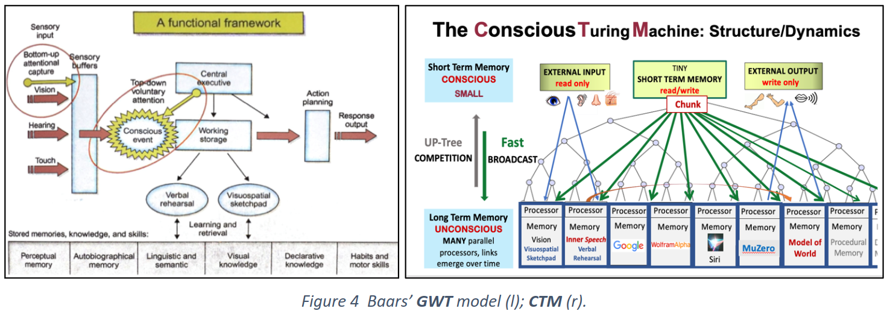

# Introduction (Work in Progress)

This a toy implementation of Lenore and Manuel Blum's model from the paper: [Theory of Consciousness from a Theoretical Computer Science Perspective: Insights from the Conscious Turing Machine](https://arxiv.org/abs/2107.13704).

The proposed model is based off the Global (Neuronal) Workspace Theory of Consciousness, with several modifications.

## Vocabulary:

### CTM Message Definition
- The message that each process node creates is a tuple of the form (address, time-step, value). The address is the unique identifier of the node, the time-step is the time at which the message was created, and the value is the value of the message.

### Stage 
- Short Term Memory (STM): This is the stage in Baar's model of conciousness where information is stored for a short period of time. This is the equivalent of the working memory in the CTM model. 
- The stage is where the information in a node is broadcasted to all the nodes in the network.

### Process Nodes
- Long Term Memory (LTM): Each node has its own specialty and memory. 

### The Up-Tree
- This is the network of process nodes that are each connected by one edge to the stage.

### The Up-Tree Competition
- The competition is a process where the message from each node is compared to the message from the other nodes. The node with the highest value is the winner of the competition. The winner's message is then broadcasted to all the nodes in the network.

### The Down-Tree
- This is a simple connection from the stage back to all the nodes in the network.

